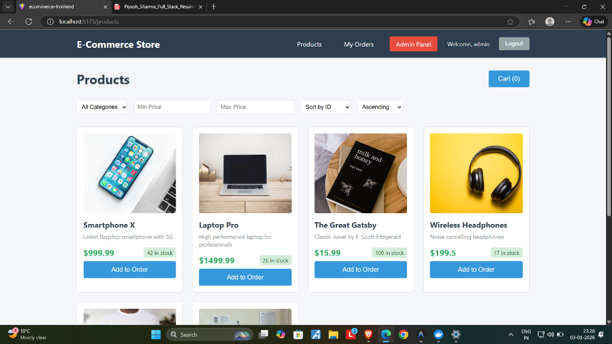
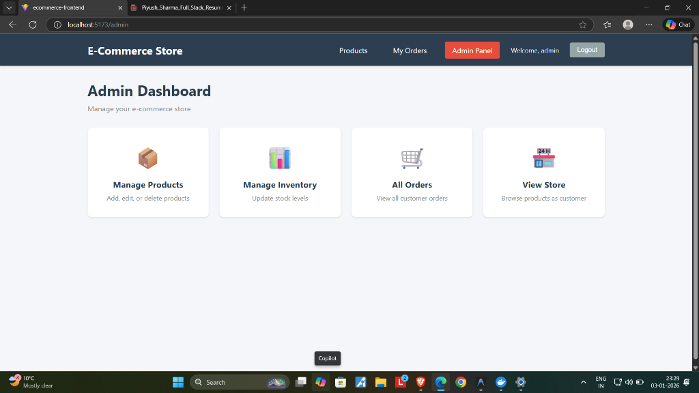
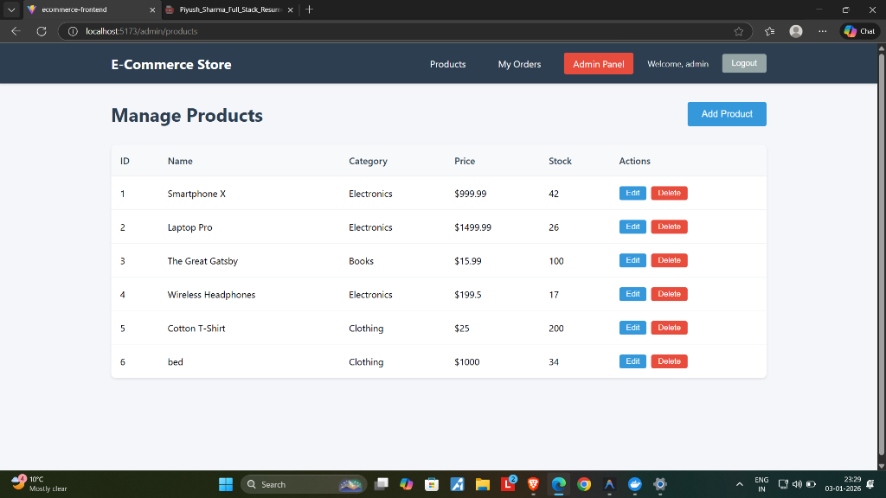
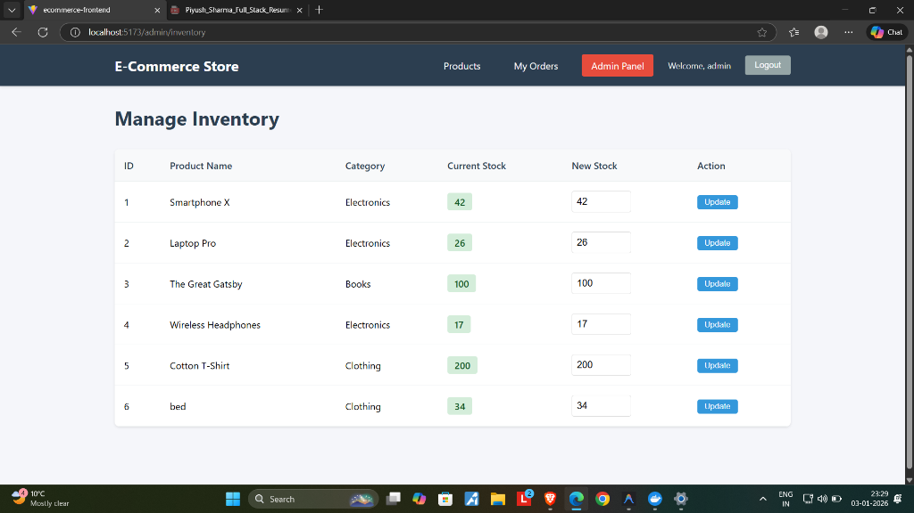
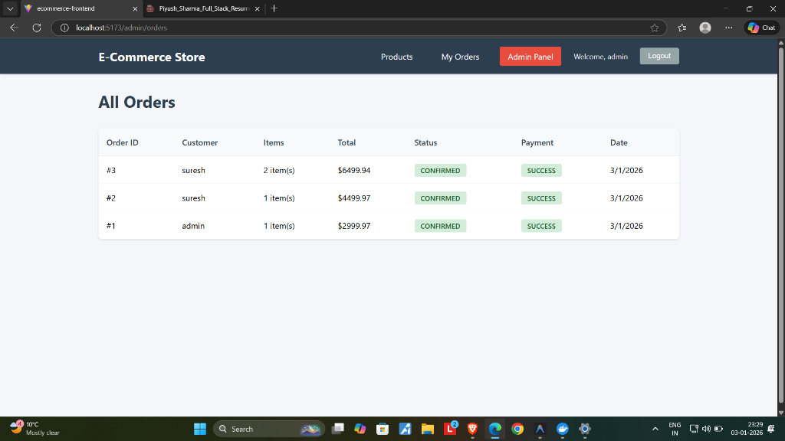

# Full-Stack E-Commerce Platform

A production-grade, scalable e-commerce platform built with **Spring Boot** (Backend) and **React** (Frontend). This system demonstrates enterprise-level development practices with clean architecture, comprehensive security, and robust transaction management.

## 📸 Screenshots

### Customer Storefront


### Admin Dashboard
| Dashboard | Product Management |
|-----------|-------------------|
|  |  |

### Operations
| Inventory Management | Order History |
|---------------------|---------------|
|  |  |

## 🚀 Features

### Frontend (React + Vite)
- **Role-Based Dashboards**: Distinct interfaces for Admins and Customers
- **Product Management**: Visual product editor with image support
- **Shopping Cart**: Real-time state management for cart operations
- **Order History**: Visual tracking of order status and payments
- **Responsive Design**: Optimized for desktop and mobile viewing
- **Secure Authentication**: JWT-based session management with auto-logout

### Backend (Spring Boot)
- **User Authentication & Authorization**: JWT-based authentication with role-based access control (USER, ADMIN)
- **Product Catalog Management**: CRUD operations with pagination, sorting, and filtering
- **Inventory Management**: Real-time stock tracking with overselling prevention
- **Order Processing**: Transactional order placement with atomic stock deduction
- **Payment Simulation**: Realistic payment processing with success/failure scenarios
- **Redis Caching**: High-performance caching for product catalog
- **Optimistic Locking**: Prevents race conditions in inventory management

## 🛠️ Technology Stack

| Component | Technology |
|-----------|-----------|
| **Frontend** | React 18, Vite, React Router 6 |
| **Styling** | CSS3, Responsive Design |
| **State Management** | React Context API |
| **Language** | Java 17 |
| **Framework** | Spring Boot 3.2.1 |
| **Database** | PostgreSQL 15 |
| **Cache** | Redis 7 |
| **Security** | Spring Security + JWT |
| **Build Tool** | Maven (Backend), NPM (Frontend) |
| **Containerization** | Docker & Docker Compose |

## 📋 Prerequisites

- **Java 17** or higher
- **Maven 3.6+**
- **Docker** and **Docker Compose**
- **Git**

## 🏗️ System Architecture

```
┌─────────────────────────────────────────────────────────────┐
│                     Client Applications                      │
└──────────────────────┬──────────────────────────────────────┘
                       │ HTTP/REST
┌──────────────────────▼──────────────────────────────────────┐
│                   API Layer (Controllers)                    │
│  AuthController │ ProductController │ OrderController │ ...  │
└──────────────────────┬──────────────────────────────────────┘
                       │
┌──────────────────────▼──────────────────────────────────────┐
│                 Business Logic (Services)                    │
│  AuthService │ ProductService │ OrderService │ PaymentService│
└──────────────────────┬──────────────────────────────────────┘
                       │
┌──────────────────────▼──────────────────────────────────────┐
│              Data Access Layer (Repositories)                │
│  UserRepository │ ProductRepository │ OrderRepository │ ...  │
└──────────────────────┬──────────────────────────────────────┘
                       │
         ┌─────────────┴─────────────┐
         │                           │
┌────────▼────────┐         ┌────────▼────────┐
│   PostgreSQL    │         │      Redis      │
│   (Primary DB)  │         │     (Cache)     │
└─────────────────┘         └─────────────────┘
```

## 🚀 Quick Start

### 1. Clone the Repository

```bash
git clone <repository-url>
cd Ecommerce
```

### 2. Configure Environment Variables

Copy the example environment file and update as needed:

```bash
cp .env.example .env
```

Edit `.env` file:
```env
DB_NAME=ecommerce_db
DB_USERNAME=postgres
DB_PASSWORD=your_secure_password
JWT_SECRET=your_jwt_secret_key_here
```

### 3. Run with Docker Compose (Backend)

```bash
docker-compose up -d
```

This will start:
- PostgreSQL database on port `5432`
- Redis cache on port `6379`
- Spring Boot application on port `8080`

### 4. Start the Frontend

Open a new terminal and navigate to the frontend directory:

```bash
cd ecommerce-frontend
npm install
npm run dev
```

The application will be available at: **http://localhost:5173**

### 5. Verify Application is Running

- **Frontend**: Visit `http://localhost:5173`
- **Backend API**: `http://localhost:8080/api/v1`

## 🔧 Local Development Setup

### Without Docker

1. **Start PostgreSQL and Redis** locally

2. **Update application.yml** with your local database credentials

3. **Run the application**:
```bash
./mvnw spring-boot:run
```

### Build JAR

```bash
./mvnw clean package
java -jar target/ecommerce-backend-1.0.0.jar
```

## 📚 API Endpoints

### Authentication

| Method | Endpoint | Description | Access |
|--------|----------|-------------|--------|
| POST | `/api/v1/auth/register` | Register new user | Public |
| POST | `/api/v1/auth/login` | Login and get JWT token | Public |

### Products

| Method | Endpoint | Description | Access |
|--------|----------|-------------|--------|
| GET | `/api/v1/products` | Get all products (paginated, filterable) | Public |
| GET | `/api/v1/products/{id}` | Get product by ID | Public |
| POST | `/api/v1/products` | Create new product | Admin |
| PUT | `/api/v1/products/{id}` | Update product | Admin |
| DELETE | `/api/v1/products/{id}` | Delete product | Admin |

### Categories

| Method | Endpoint | Description | Access |
|--------|----------|-------------|--------|
| GET | `/api/v1/categories` | Get all categories | Public |
| GET | `/api/v1/categories/{id}` | Get category by ID | Public |
| POST | `/api/v1/categories` | Create category | Admin |
| PUT | `/api/v1/categories/{id}` | Update category | Admin |
| DELETE | `/api/v1/categories/{id}` | Delete category | Admin |

### Orders

| Method | Endpoint | Description | Access |
|--------|----------|-------------|--------|
| POST | `/api/v1/orders` | Place new order | User |
| GET | `/api/v1/orders/my-orders` | Get user's order history | User |
| GET | `/api/v1/orders/{id}` | Get order by ID | User/Admin |
| GET | `/api/v1/orders` | Get all orders (paginated) | Admin |

### Inventory

| Method | Endpoint | Description | Access |
|--------|----------|-------------|--------|
| PUT | `/api/v1/inventory/{productId}` | Update product stock | Admin |
| GET | `/api/v1/inventory/low-stock` | Get low stock products | Admin |

## 🔐 Authentication Flow

1. **Register a new user**:
```bash
POST /api/v1/auth/register
{
  "username": "john_doe",
  "email": "john@example.com",
  "password": "securePassword123"
}
```

2. **Login to get JWT token**:
```bash
POST /api/v1/auth/login
{
  "username": "john_doe",
  "password": "securePassword123"
}
```

Response:
```json
{
  "token": "eyJhbGciOiJIUzI1NiIsInR5cCI6IkpXVCJ9...",
  "type": "Bearer",
  "id": 1,
  "username": "john_doe",
  "email": "john@example.com",
  "roles": ["ROLE_USER"]
}
```

3. **Use token in subsequent requests**:
```bash
Authorization: Bearer <your-jwt-token>
```

## 📦 Database Schema

### Key Entities

- **User**: User accounts with roles
- **Role**: ROLE_USER, ROLE_ADMIN
- **Product**: Product catalog with pricing and stock
- **Category**: Product categories
- **Order**: Customer orders
- **OrderItem**: Individual items in an order
- **Payment**: Payment transactions

### Relationships

- User ↔ Role (Many-to-Many)
- Product → Category (Many-to-One)
- Order → User (Many-to-One)
- Order ↔ OrderItem (One-to-Many)
- Order ↔ Payment (One-to-One)
- OrderItem → Product (Many-to-One)

## 🧪 Testing the Application

### Using cURL

**Register a user**:
```bash
curl -X POST http://localhost:8080/api/v1/auth/register \
  -H "Content-Type: application/json" \
  -d '{
    "username": "testuser",
    "email": "test@example.com",
    "password": "password123"
  }'
```

**Login**:
```bash
curl -X POST http://localhost:8080/api/v1/auth/login \
  -H "Content-Type: application/json" \
  -d '{
    "username": "testuser",
    "password": "password123"
  }'
```

**Get products** (with pagination and filtering):
```bash
curl "http://localhost:8080/api/v1/products?page=0&size=10&sortBy=price&sortDir=ASC&minPrice=10&maxPrice=100"
```

### Using Postman

Import the provided `postman_collection.json` file into Postman for a complete set of pre-configured API requests.

## 🔒 Security Features

- **Password Hashing**: BCrypt with salt
- **JWT Tokens**: 24-hour expiration
- **Role-Based Access Control**: Fine-grained permissions
- **CORS Configuration**: Configurable cross-origin requests
- **SQL Injection Prevention**: JPA/Hibernate parameterized queries
- **Input Validation**: Jakarta Bean Validation

## 📈 Performance Optimizations

- **Redis Caching**: Product catalog cached with 1-hour TTL
- **Database Indexing**: Indexed columns on frequently queried fields
- **Lazy Loading**: Efficient entity loading strategies
- **Connection Pooling**: HikariCP for database connections
- **Optimistic Locking**: Prevents concurrent update conflicts

## 🐛 Error Handling

All errors return consistent JSON responses:

```json
{
  "timestamp": "2024-01-01T12:00:00",
  "status": 404,
  "error": "Not Found",
  "message": "Product not found with id: '123'",
  "path": "/api/v1/products/123"
}
```

## 📝 Environment Variables

| Variable | Description | Default |
|----------|-------------|---------|
| `DB_HOST` | PostgreSQL host | localhost |
| `DB_PORT` | PostgreSQL port | 5432 |
| `DB_NAME` | Database name | ecommerce_db |
| `DB_USERNAME` | Database username | postgres |
| `DB_PASSWORD` | Database password | postgres |
| `REDIS_HOST` | Redis host | localhost |
| `REDIS_PORT` | Redis port | 6379 |
| `JWT_SECRET` | JWT signing secret | (see .env.example) |
| `SPRING_PROFILE` | Active profile | dev |

## 🚀 Deployment

### Production Considerations

1. **Change default credentials** in `.env`
2. **Generate a strong JWT secret**
3. **Enable Redis authentication**
4. **Use HTTPS** for all communications
5. **Set up proper logging** and monitoring
6. **Configure database backups**
7. **Use environment-specific profiles**

### Docker Production Build

```bash
docker-compose -f docker-compose.yml up -d --build
```

## 📂 Project Structure

```
ecommerce-backend/
├── src/main/java/com/ecommerce/
│   ├── config/              # Configuration classes
│   ├── controller/          # REST controllers
│   ├── dto/                 # Data Transfer Objects
│   ├── entity/              # JPA entities
│   ├── exception/           # Custom exceptions
│   ├── repository/          # Spring Data repositories
│   ├── security/            # Security components
│   ├── service/             # Business logic
│   └── EcommerceApplication.java
├── src/main/resources/
│   └── application.yml      # Application configuration
├── Dockerfile
├── docker-compose.yml
├── pom.xml
└── README.md
```

## 🧠 Key Learnings & Challenges

Building this project taught me how to bridge the gap between frontend and backend:

- **State Management**: Using React Context API to manage global auth state while preventing prop drilling.
- **Transactional Integrity**: Learned why `@Transactional` is crucial for inventory management to prevent race conditions during concurrent orders.
- **Security Best Practices**: Implemented a stateless JWT architecture instead of sessions, understanding the trade-offs in scalability.
- **Docker Compose**: Orchestrating multiple services (App, DB, Cache) into a single deployable unit.

## 🚀 Future Improvements

- [ ] **Payment Gateway Integration**: Replace the simulation with Stripe or Razorpay.
- [ ] **Email Notifications**: Use RabbitMQ to send async order confirmation emails.
- [ ] **Product Reviews**: Allow users to rate and review purchased products.
- [ ] **CI/CD Pipeline**: Automate testing and deployment using GitHub Actions.

## 👨‍💻 Author

**Piyush Sharma**
- [LinkedIn](#)
- [Portfolio](#)

---
*This project was built to demonstrate Full Stack proficiency for recruitment purposes.*
